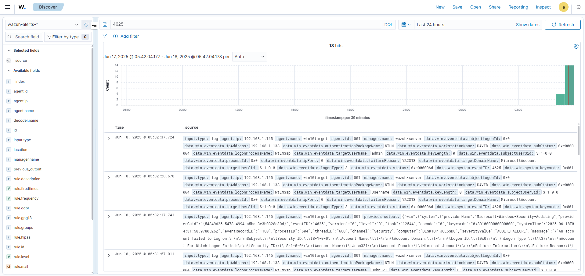

# 🛡️ Incident Report – RDP Brute-Force Attempt

## 📌 Summary
This incident report documents a simulated brute-force attack against a Windows 10 virtual machine using Remote Desktop Protocol (RDP). The Wazuh SIEM successfully detected multiple failed login attempts (Event ID 4625) through Windows Security logs, demonstrating effective log collection and threat detection.

---

## 🧱 Environment

- **SIEM**: Wazuh 4.12 All-in-One (OVA)
- **Target**: Windows 10 VM (`win10target`)
- **Attacker**: Host machine using `mstsc` RDP client
- **Network**: Bridged adapter, internal IP: `192.168.1.145`

---

## 🔍 Attack Scenario

- ~15 failed RDP login attempts executed within 2 minutes
- Username variations used: `admin`, `hacker`, `guest`, `John321`, `Username`
- Attack originated from host (simulating external brute-force)
- Windows recorded Event ID `4625` in the Security log

---

## 📡 Detection

- Wazuh agent successfully collected Windows Security log via `eventchannel`
- Log entry:  
  - `event_id: 4625`  
  - `logon_type: 3` (network login)  
  - `failure_reason: %%2313` (wrong credentials)  
  - `authenticationPackageName: NTLM`  
- SIEM log visible in `wazuh-alerts-*` index (Kibana Discover)
- Screenshot:  
  

---

## ⚖️ CVSS (Informal)

- **Attack Vector**: Network  
- **Privileges Required**: None  
- **User Interaction**: None  
→ **CVSS 3.1 Base Score**: 8.0 (High)

---

## 🛠️ Response

- No blocking action triggered (lab-only setup)
- Recommended:
  - Enable account lockout policies
  - Limit RDP exposure via firewall or VPN
  - Enable logging for logon attempts and failures

---

## 🧠 Lessons Learned

- Wazuh agent requires proper config (no `<query>` filters blocking 4625)
- Windows `Security` log must be explicitly collected
- Even simple simulation shows the power of SIEM log correlation
- This setup can be extended with alert rules and active responses

---

## 🧰 Tools Used

- `mstsc` (RDP client)
- Wazuh SIEM
- PowerShell (agent config + service mgmt)
- Kibana Discover (log search)
